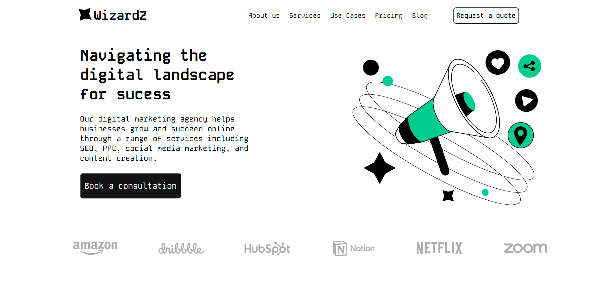

# 🧙‍♂️ WizardZ - Landing Page

## 📌 Sobre o Projeto

A **WizardZ Landing Page** é um projeto front-end desenvolvido com foco em apresentação institucional para uma agência de marketing digital fictícia.

A proposta da página é transmitir modernidade, profissionalismo e clareza na comunicação dos serviços oferecidos, como:

- SEO
- PPC
- Social Media Marketing
- Criação de Conteúdo

O layout foi construído com uma estética minimalista, utilizando uma paleta clean com destaque em verde e preto, além de elementos gráficos modernos.

---

## 🚀 Tecnologias Utilizadas

- **HTML5**
- **CSS3**
- **JavaScript**
- Responsividade com boas práticas de layout

---

## 🎯 Objetivo do Projeto

Este projeto foi desenvolvido com o objetivo de:

- Praticar estruturação semântica em HTML
- Trabalhar estilização moderna com CSS
- Desenvolver layout responsivo
- Simular uma landing page profissional para portfólio
- Evoluir habilidades em front-end

---

## 🖥️ Estrutura da Página

A landing page contém:

- Header com navegação
- Seção principal (Hero Section)
- Botão de Call-to-Action
- Ilustração moderna
- Seção de marcas/parceiros
- Layout visual focado em conversão

---

## 📷 Preview

Abaixo está a prévia da interface:



---

## 🔮 Futuras Atualizações

Em versões futuras do projeto, será realizada:

- 🔁 **Integração com React**
- Componentização da interface
- Organização do projeto em arquitetura escalável
- Possível integração com backend
- Melhorias em performance

O objetivo é transformar a landing page em uma aplicação moderna utilizando **React.js**, aplicando boas práticas como componentização, props e organização por pastas.

---

## 📂 Como Executar o Projeto

1. Clone o repositório:
```bash
git clone https://github.com/gustavocsantos-dev/Landing-Page---WizardZ.git
```

2. Acesse a pasta do projeto:

```bash
cd landing-page-wizardz
```

3. Abra o arquivo principal:

- Localize o arquivo index.html na pasta raiz.

- Dê um duplo clique no arquivo ou arraste-o para dentro do seu navegador de preferência (Chrome, Firefox, Edge, etc.).
---

## 👨🏻‍💻 Autor

Desenvolvido por Gustavo Carvalho dos Santos

---

## 🔗 GitHub:
https://github.com/gustavocsantos-dev